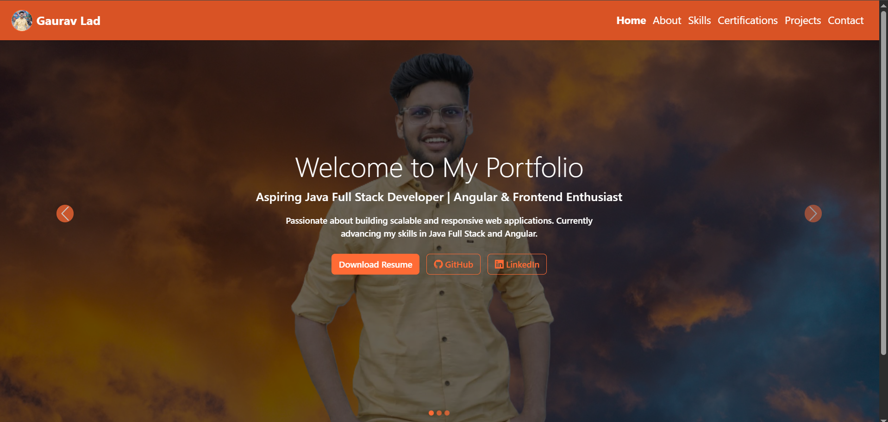
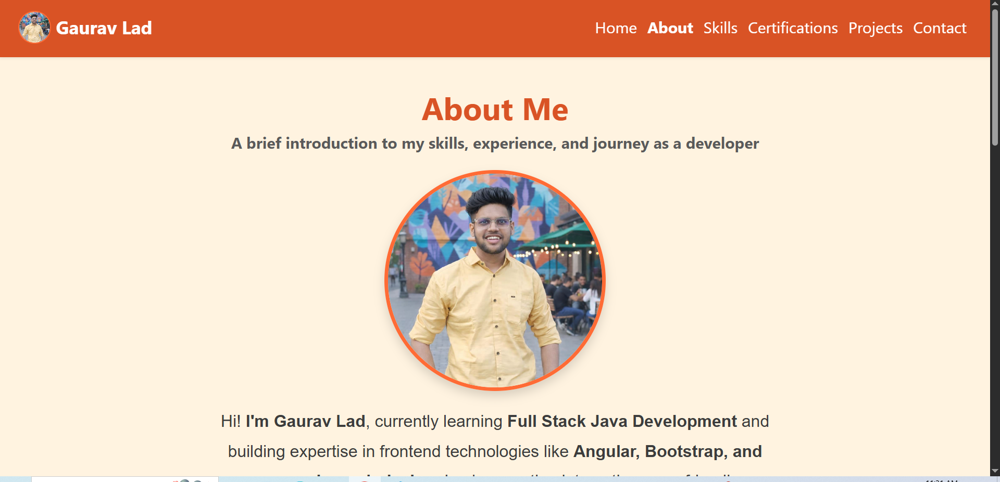
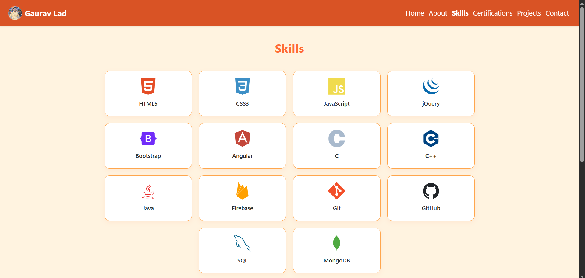
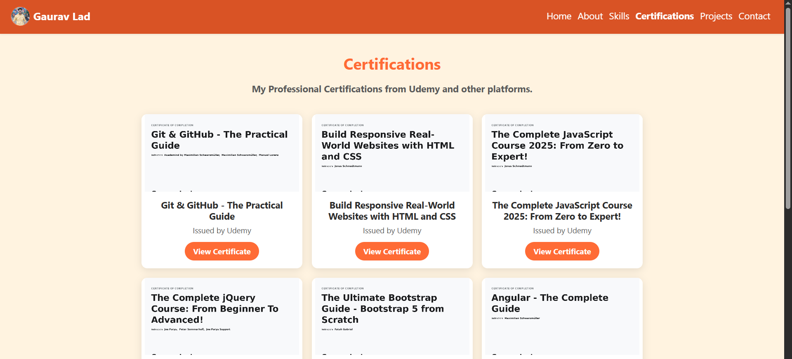
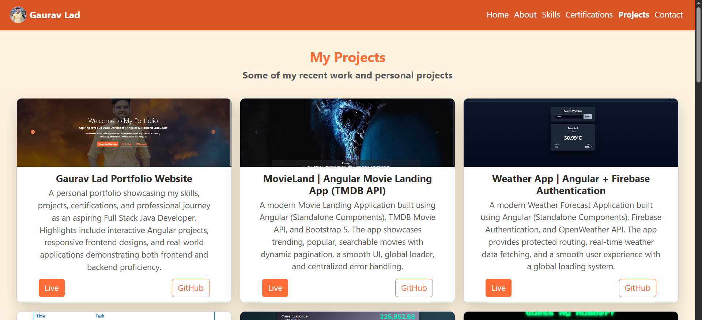
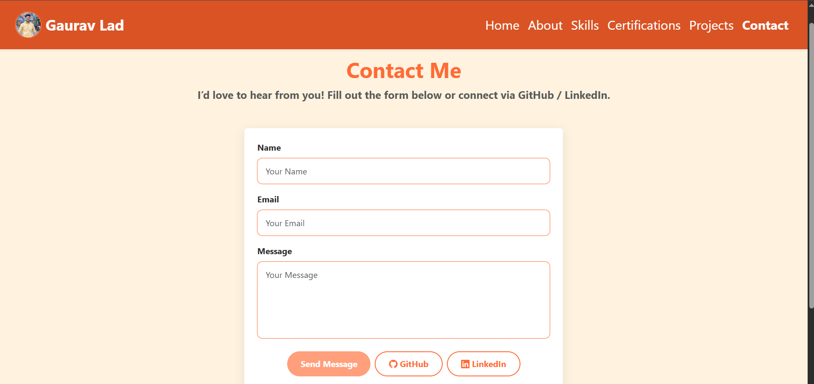
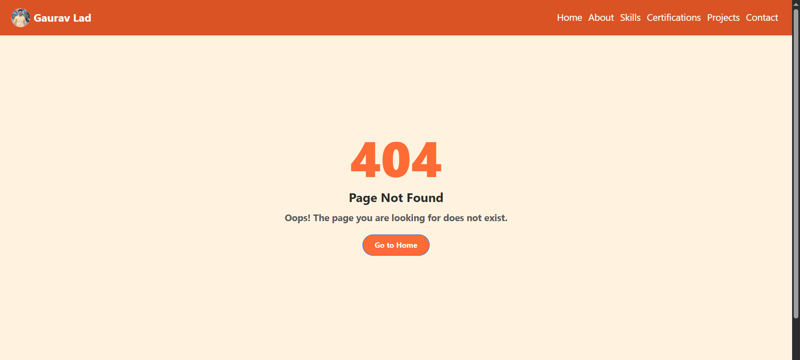

# ✅ Gaurav Lad | My Portfolio Website

**A personal portfolio showcasing my skills, projects, certifications, and professional journey as an aspiring Full Stack Java Developer. Highlights include interactive Angular projects, responsive frontend designs, and real-world applications demonstrating both frontend and backend proficiency.**

[](https://angular.io/)
[](https://getbootstrap.com/)
[](https://www.emailjs.com)
[](https://www.netlify.com/)
[](https://github.com/gaurav-j-lad)

---

## 🎨 Features

- 🏠 Hero section with profile picture and intro
- 👨‍💻 About Me section with education, experience, and skills
- 💡 Skills section with interactive progress indicators
- 🎓 Certifications section with Udemy certificates and online links
- 🎯 Projects section with live demos and GitHub links
- 📬 Contact section with **EmailJS integration** for direct messages
- ❌ 404 Not Found page for unmatched routes
- 🎨 Orange Theme with consistent colors across the site
- 📱 Fully responsive and mobile-friendly layout

---

## 🛠️ Built With

| Technology                            | Purpose                         |
| ------------------------------------- | ------------------------------- |
| 🅰️ Angular 20 (Standalone Components) | Frontend framework              |
| 📄 Bootstrap 5                        | Responsive UI layout            |
| 🎨 CSS / SCSS                         | Custom styling                  |
| 📬 EmailJS                            | Contact form integration        |
| 🔄 RxJS                               | Reactive forms & async handling |
| 🧩 Angular Router                     | Navigation & lazy loading       |
| 💻 TypeScript                         | App logic                       |
| 🧰 Git / GitHub                       | Version control                 |

---

## 📸 Screenshots

### 🏠 Home Page



### 👨‍💻 About Me



### 💡 Skills Page



### 🎓 Certifications



### 🎯 Projects



### 📬 Contact Form



### ❌ Not Found Page



---

## 🌐 Live Demo

🌐 **Netlify Live Demo:**
👉 [https://gaurav-lad-portfolio.netlify.app](https://gaurav-lad-portfolio.netlify.app)

---

## 📬 Contact Form Setup (EmailJS)

1. Sign up at [EmailJS](https://www.emailjs.com)
2. Add a **service** (Gmail, etc.) → get **Service ID**
3. Create a **Contact template** → get **Template ID**
4. Get your **Public Key** from the dashboard
5. Update `contact-page.component.ts`:

```ts
emailjs.send('YOUR_SERVICE_ID', 'YOUR_TEMPLATE_ID', this.contactForm.value, 'YOUR_PUBLIC_KEY');
```

## 📧 Let’s Connect

**🔗 LinkedIn**
👉 [https://www.linkedin.com/in/gaurav-lad1974](https://www.linkedin.com/in/gaurav-lad1974)

**📨 Email**
👉 [gauravlad1974@gmail.com](mailto:gauravlad1974@gmail.com)

**🌐 GitHub**
👉 [https://github.com/gaurav-j-lad](https://github.com/gaurav-j-lad)
